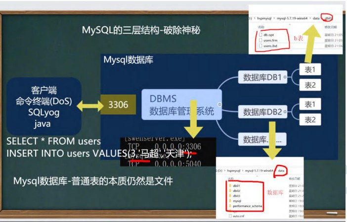

##数据库的基本知识和MySQL

###数据库
>***数据库 （database）*** 指保存有组织的数据的容器，热门一般情况说的数据库指的是数据库软件，即数据库管理系统 ***（DBMS）*** ，而数据库实确切的应该说是通过的DBMS创建和操纵的容器。数据库本质上是一个文件。

####表
我们将数据放入特定的文件中，这种文件称为表，表是一种结构化的文件，用来存储用户的相关信息，每个表都有唯一的一个名字来标识自己。
创建表时我们要指定有哪些字段，或者说定义表的特性，它规定了在表中存储哪些数据，数据类型什么。表由列和行构成。

####列和数据类型
一列就是表中的一个字段，比如说可以是用户名，住址，联系电话等，每一列都有相应的数据类型，通过数据类型可以限制向表中存储的数据，同时还可以帮助对数据的排序等

####行
行指的是表中的一个记录，每一行可以对应一个客户，一行存储一个用户的所有信息。

####SQL
>***结构化查询语言（SQL Structured Query Language）*** 是一种专门用来与数据库通信的语言，SQL由很少的关键词构成，但是是一种强有力的语言，能够进行非常复杂和高级的数据库操作。

---

###MySQL
MySQL是一种数据库管理软件,MySQL的层次结构如下:

####启动和连接
在命令行下执行
* 启动MySQL服务
~~~Shell
net start mysql
~~~
* 关闭MySQL服务
~~~Shell
net stop mysql
~~~
* 连接MySQL
~~~Shell
mysql -h 主机 -P 端口 -u 用户名 -p密码
//没有写-h 主机，主机默认为本机
//没有写-P 端口，默认为3306端口，实际工作中不用
~~~

**学习总结来源于[<u>韩顺平老师一周学会Linux</u>](https://www.bilibili.com/video/BV1Sv411r7vd?spm_id_from=333.788.top_right_bar_window_custom_collection.content.click)**
