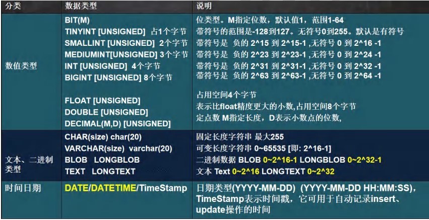

##MySQL数据类型和表操作

###整型的定义
~~~SQL
//创建有符号整数表
CREATE TABLE t1 (id TINYINT);
//创建无符号整数表
CREATE TABLE t2 (id TINYINT UNSIGNED);
~~~
###BIT类型的定义
~~~SQL
//bit(m) m 在 1-64
//添加数据范围按照给的位数来确定,比如 m = 8 表示一个字节 大小为0~255,显示按照2进制逐一显示
//查询时，仍然可以按照数来查询
CREATE TABLE t3 (num BIT(8));
~~~
**Tips:当一个只有正负，对错，0-1时可以用BIT来定义以节省空间**

###浮点数的定义
主要对decimal做一个说明，**DECIMAL[M,D]**，
* M表示小数位数，代表精度.D是小数点后面的位数，代表大小
* 当 **D=0** 时，则是一个整数，M最大为65，D最大为30
* D省略，默认时0，M省略，默认为10
~~~SQL
//创建一个由三种浮点数构成的表
CREATE TABLE t06 (
    num1 FLOAT, 
    num2 DOUBLE, 
    num3 DECIMAL(30,20));
~~~

###字符串的定义
* ***CHAR(size)*** 固定长度字符串，**size：0~255** ，无论我们存入的数据有多大或多小，占有的空间都是在创建表时规定的。**这里size的范围指的是字符数，不论是中文字符还是其它字符都只占一个字符。**
* ***VARCHAR(size)*** 可变长度字符串， **size: 0~65535** ，数据占有的空间与它本身有关，**这里size的范围指的是字节，具体可以保存多少个字符与使用的编码方式有关**，采用四个字节的utf8mb4编码，最长为（65535-3）/4=16383个字符；采用2个字节的gbk编码，最长为（65535-3）/2=32766个字符。（需要保留三个bit位存储数据大小）
* 两种数据类型 ***size*** 都指的是字符数，在**CHAR**中表示占有固定空间，在**VARCHAR**中表示最长字符数量可以是。
~~~SQL
//创建gbk编码的字符串表，未指定编码方式时，采用创建数据库时指定的编码方式
CREATE TABLE t10 (
    `name` VARCHAR(32766)) 
    CHARSET gbk;
~~~
**Tips：关于CHAR和VARCHA，TEXT的使用**
* 当字符串是定长，例如邮编，手机号，身份证是，使用 **CHAR** 类型来保存
* 当字符串是不定长，如名字等等，使用 **VARCHAR**
* 查询速度：**CHAR > VARCHAR**
* 存放文本时可以用 **TEXT**,可以将 **TEXT** 视为 **VARCHAR**，存放数据范围相同，如果需要保存更长的文本数据在使用 **MEDIUMTEXT** 和 **LONGTEXT**
###时间类型定义
~~~SQL
//创建一张与时间有关的表
CREATE TABLE t14 (
birthday DATE , 
job_time DATETIME,
login_time TIMESTAMP
NOT NULL DEFAULT CURRENT_TIMESTAMP --没有指定时间时，采用当前时间
ON UPDATE CURRENT_TIMESTAMP); --更新数据时，用当前时间更新时间戳
~~~
###字段定义的限制条件
####NOT NULL
要求字段的数据不为空，否则报错，空字符串是有效的，当输入null时会报错
####DEFAULT
当没有输入数据时，使用默认值。如果使用null值时如果没有**NOT NULL**约束不会报错
####两者一起使用
当输入null时报错，不指定任何值时用默认值代替。
###表的修改
使用 **ALTER TABLE** 可以对表进行追加，修改和删除
####添加表字段
**ALTER TABLE** <表名> **ADD** <新字段名><数据类型>[位置];
~~~SQL
ALTER TABLE emp ADD level INT
~~~
####修改表字段
**ALTER TABLE** <表名> **MODIFY** <字段名><数据类型>[位置];
~~~SQL
ALTER TABLE emp MODIFY name VARCHAR(32)
~~~
####删除表字段
**ALTER TABLE** <表名> **DROP** <字段名>
~~~SQL
ALTER TABLE emp DROP sex
~~~
####重命名字段
**ALTER TABLE** <表名> **CHANGE** <老字段名> <新字段名>[位置]
~~~SQL
ALTER TABLE emp CHANGE user `user_name` 
~~~
####重命名表
**RENAME TABLE** <旧表名> **TO** <新表名>
~~~SQL
RENAME TABLE emp TO employee 
~~~
####位置属性
添加字段时，不指定位置，默认在最后添加新字段。指定位置有以下几种方式。
#####在开头添加
使用关键字 **FIRST**
~~~SQL
ALTER TABLE emp ADD level INT FIRST
~~~
#####在中间添加
如果想要在某个字段后添加可以使用关键字 **AFTER**+指定字段
~~~SQL
ALTER TABLE emp ADD level INT AFTER birthday
~~~
###查看表结构
**DESC <表名>**
~~~SQL
DESC yjh_db01
~~~
###表复制
有时候我们需要对sql语句进行测试，会需要海量数据，为了不破坏原表的结构，我们可以先建一张表，并把原表的内容复制过来，再让新表自我复制。
~~~SQL
-- 使用like语句可以方便的创建一个相同的结结构的表
CREATE TABLE emp2 LIKE emp
-- 复制emp表到emp2表
INSERT INTO emp2
    SELECT * FROM emp
-- 自我复制
INSERT INTO emp2
    SELECT * FROM emp2
~~~

###表去重
表去重的操作和复制表基本相同，只需要把表复制过来时使用DISTINCT关键字
~~~SQL
-- 先创建一张临时表 my_tmp , 该表的结构和 my_tab02 一样
create table my_tmp like emp2
-- 把 my_tmp 的记录 通过 distinct 关键字 处理后 把记录复制到 my_tmp
insert into my_tmp
    select distinct * from emp2;
-- 清除掉 my_tab02 记录
delete from emp2
--  把 my_tmp 表的记录复制到 my_tab02
insert into emp2
    select * from my_tmp; 
--  drop 掉 临时表 my_tmp
drop table my_tmp;
~~~
**学习总结来源于[<u>韩顺平老师一周学会MYSQL</u>](https://www.bilibili.com/video/BV1H64y1U7GJ?spm_id_from=333.999.0.0&vd_source=352d2df9b015068a15a74f8ed4486f20)**
