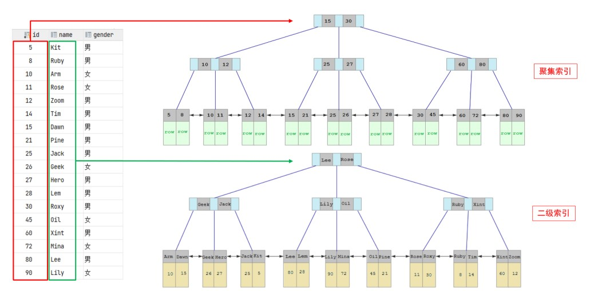
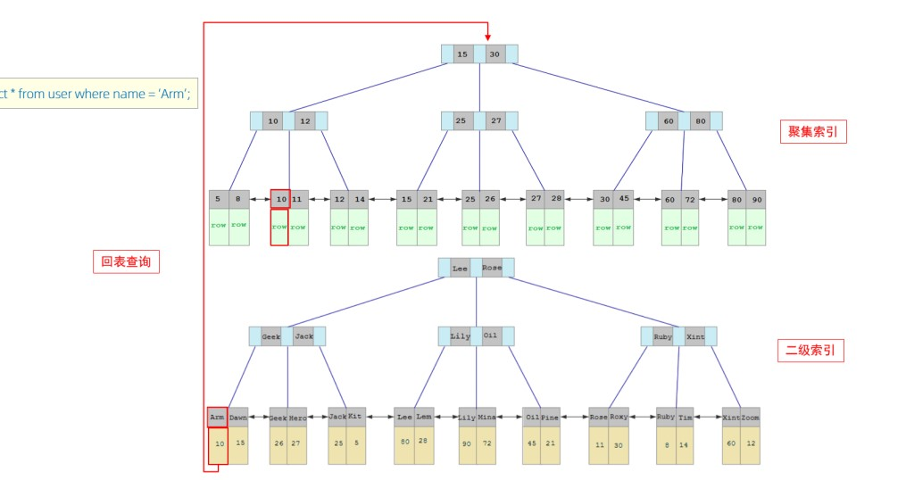

#MySQL索引
>索引能够极大的提升数据库的查找性能，合理的设置索引，不需要增加内存，也不需要调整数据数据库语句，查询速度就能得到很大提升.在没有设置索引时，使用查找语句会对整个表全盘扫描，当数据量很大时，时间开销很大，当设置索引后，会形成一个索引的数据结构（B树，B+树），即使有海量的数据，查询速度依旧非常快。

设置索引也会有代价：
* 磁盘空间占用增加（空间换时间），因此没有必要设置很多的索引
* dml（insert，update，delete）语句的效率会降低（树的修改删除操作牵一发动全身）

##索引的类型
1. 主键索引，设置主键约束的字段自动建立索引
2. 唯一索引，设置唯一约束的字段自动建立索引
3. 普通索引，使用INDEX...ON手动创建索引
4. 全文索引，一般使用第三方工具创建

###聚集索引和二级索引
在InnoDB存储引擎中，根据索引的存储形式，又可以分为以下两种
|分类|定义|特点|
|--|--|--|
|聚集索引|数据存储和索引放一起，叶子节点保存了数据|有且只有一个|
|二级索引|数据和索引分开，叶子节点下面挂的是主键|可以有多个|
* 如果存在主键，主键为聚集索引
* 没有主键，使用第一个唯一索引作为聚集索引
* 主键和唯一索引都没有时，使用rowid作为隐藏的聚集索引

###回表查询
当使用二级索引时，如果二级索引的数据和主键索引的信息不满足查询的要求，会利用主键信息到聚集索引表中查询需要的数据，这种查询方式叫回表查询

##索引结构
###B树
B树是一颗多路平衡查找树，相比于二叉树，B树的每个每个节点可以存放多个数据，指向不同的分支。以5-阶树为例，每个节点有五个指针域和四个数据域，指针指向不同分支，数据域用来判断插入和删除时应该走哪个分支。

B树的特点：
* 当数据与超过了5.中间的元素会向上分裂，然后该节点裂开为两个节点
* B树的叶子节点和非叶子节点都存放数据

>思考题：为什么不用红黑树做索引结构？

>大规模的数据存储时，索引结构是存储在磁盘中的，用二叉树的结构做索引会使树变得很深，这样在查询时会造成频繁的磁盘读写，导致查询效率过低，因此提出了多路查找树来降低树的深度，提高查找效率。

###B+树
B+树是B树的变体，相比B树，它有以下新特征：
* 非叶子节点的数据域只用来做索引，而不保存关键字，具体的数据存放在叶子节点上
* 叶子节点之间相互连接，所有的数据构成了一个单向链表

>Mysql为什么使用B+树做索引结构而不用B树

>1.B+树非叶子节点不存储数据，因此能存储更多的索引关键字，降低了树的深度，查找效率更高
>2.B+树的叶子节点相互连接，能更好的支持范围查找
##索引语法
###创建索引
**方式一：CREATE INDEX 索引名称 ON 表名（列名）**
**方式二：ALTER TABLE 表名 ADD INDEX 索引名称（列名）**
~~~SQL
-- 方式一
CREATE INDEX id_index ON emp(id)
-- 方式二
ALTER TABLE emp ADD INDEX id_index (id)
~~~
###删除索引
**语法 DROP INDEX 索引名称 ON 表名**
~~~SQL
DROP INDEX id_index ON emp
~~~
###查询索引
**语法：SHOW INDEX FROM 表名**
~~~SQL
SHOW INDEX FROM emp
~~~

##性能分析
###执行频率
MySQL 客户端连接成功后，通过 **show [ ses sion | global ]status** 命令可以提供服务器状态信息。通过如下指令，可以查看当前数据库的INSERT、 UPDATE、 DELETE、 SELECT的访问频次：
~~~SQL
SHOW GLOBAL STATUS LIKE 'Com______'
~~~
###慢查询日志
慢查询日志记录了所有执行时间超过指定参数（long_query_time，默认1 0秒）的所有SQL语句的日志。
~~~SQL
//慢查询日志开启情况和日志文件的位置
show variables like 'slow_query%'
//查看查询时间超过多少会被记录
SHOW VARIABLES LIKE 'long_query_time';
~~~
在Windows下修改my.ini文件可以设置慢查询开关和查询时间上限
>[mysqld]
slow_query_log=1
long_query_time=n

###profile
show profiles 能够在做SQL优化时帮助我们了解时间都耗费到哪里去了。
~~~SQL
-- 是否支持profile操作
select @@have_profiling
-- 是否开启profile开关
select @@have_profiling
-- 开启开关
set profiling = 1
-- 查看每一条SQL的耗时基本情况
show profiles ;
-- 查看指定query_id的SQL语句各个阶段的耗时情况
show profile for query query_id;
-- 查看指定query_id的SQL语句CPU的使用情况
show profile cpu for query query_id;
~~~
###explain
EXPLAIN 或者 DESC命令获取 MySQL 如何执行 SELECT 语句的信息，包括在 SELECT 语句执行过程中表如何连接和连接的顺序。
**语法：EXPLAIN SELECT 字段列表 FROM 表名 WHERE 条件**
####字段执行含义
|字段| 含义|
|--|--|
|id|select查询的序列号，表示查询中执行select子句或者是操作表的顺序( id相同，执行顺序从上到下； id不同，值越大，越先执行)。|
|select_type|表示 SELECT 的类型，常见的取值有 SIMPLE、PRIMARY、UNION、SUBQUERY等|
|type|表示连接类型，性能由好到差的连接类型为NULL、 system、 const、eq_ref、 ref、 range、 index、 all 。pos sible_key 显示可能应用在这张表上的索引，一个或多个。key 实际使用的索引，如果为NULL，则没有使用索引。
|key_len|表示索引中使用的字节数， 该值为索引字段最大可能长度，并非实际使用长度，在不损失精确性的前提下， 长度越短越好 。
|rows|MySQL认为必须要执行查询的行数，在innodb引擎的表中，是一个估计值，可能并不总是准确的。|
|filtered| 表示返回结果的行数占需读取行数的百分比， filtered 的值越大越好。|
##使用规则
###最左前缀法则
如果索引了多列（联合索引），要遵守最左前缀法则。最左前缀法则指的是查询从索引的最左列开始，并且不跳过索引中的列。如果跳跃某一列，索引将会部分失效 (后面的字段索引失效)。
###索引失效情况
* 联合索引中，出现范围查询 ( >, < )，范围查询右侧的列索引失效。
* 在索引列上做运算，索引会失效
* 字符串类型字段使用时，不加引号，索引将失效。
* 尾部模糊匹配，索引不会失效。如果是头部模糊匹配，索引失效。
* 用or分割开的条件， 如果or前的条件中的列有索引，而后面的列中有索引，那么涉及的索引都不会被用到。
* 如果MySQL评估使用索引比全表更慢，则不使用索引。

##索引优化
###SQL提示
SQL提示，是优化数据库的一个重要手段，简单来说，就是在SQL语句中加入一些人为的提示来达到优化操作的目的。
1. use index() 建议使用索引
2. ignore index() 忽略索引
3. force index() 强制使用索引
###覆盖索引
覆盖索引是指查询使用了索引，并且需要返回的列，在该索引中已经全部能够找到，如果没有找到则需要进行回表查询，是否覆盖索引可以通过explain中的extra信息查看。
|Extra|含义|
|-|-|
|Using where,Using index|覆盖索引|
|Using index condition|使用了索引，但是需要回表查询|
###前缀索引
当字段类型为字符串（varchar，text，longtext等）时，有时候需要索引很长的字符串，这会让索引变得很大，查询时，浪费大量的磁盘IO， 影响查询效率。此时可以只将字符串的一部分前缀，建立索引，这样可以大大节约索引空间，从而提高索引效率。
~~~SQL
//用邮箱的前五位作为索引
create index idx_email_5 on tb_user ( email ( 5 ) ) ;
~~~

