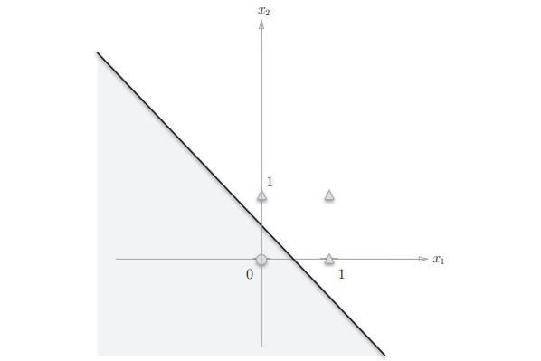
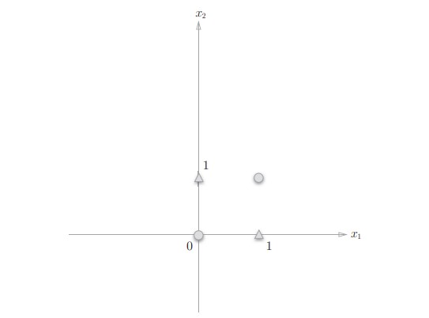
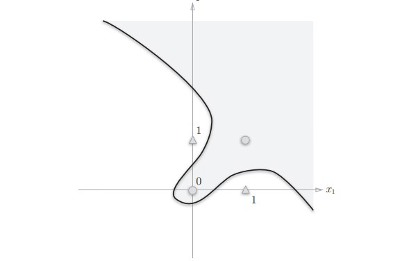
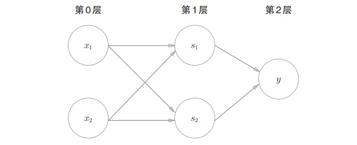
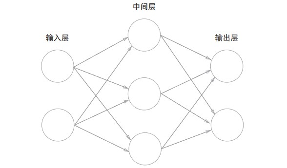
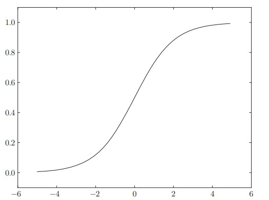
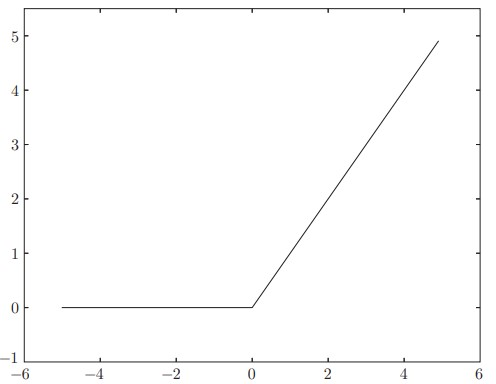

#深度学习笔记
##一、感知机
###1.1感知机是什么
感知机由美国学者 ***Frank Rosenblatt*** 在1957年提出来的。感知机是作为神经网络（深度学习）的起源的算法。感知机接收多个输入信号，输出一个信号。
图 1-1是一个接收两个输入信号的感知机的例子。 $x_1$、 $x_2$是输入信号，$y$是输出信号， $w_1$、 $w_2$是**权重** 。输入信号被送往神经元时，会被分别乘以固定的权重($w_1x_1$、 $w_2x_2$)。

神经元会计算传送过来的信号的总和，只有当这个总和超过了某个界限值时，才会输出1。这也称为 **神经元被激活**。这里将这个界限值称为**阈值**，用符号$\theta$表示。用数学公式可以表示为: 
$$
        y =
        \begin{cases}
        0,  & \text{ ($w_1x_1$ + $w_2x_2$) $\leq$  $\theta$} \\
        1, & \text{ ($w_1x_1$ + $w_2x_2$) > $\theta$}
        \end{cases}
$$

###1.2简单逻辑电路
####1.2.1与门的表示
以逻辑电路的角度来思考感知机，首先看看如何用感知机来表示与门，与门的真值表如下：
|$x_1$|$x_2$|$y$|
|--|--|--|
|0|0|0|
|0|1|0|
|1|0|0|
|1|1|1|
根据真值表可以知道实际上由多种参数可以选择以满足上述的条件。比如($w_1$,$w_2$,$\theta$) = (0.5,0.5,0.9)或者($w_1$,$w_2$,$\theta$) = (1.0,1.0,1.0)。只用保证$x_1$、$x_2$同时为1时，加权和大于$\theta$即可。
####1.2.2非门和或门的表示
非门的真值表
|$x_1$|$x_2$|$y$|
|--|--|--|
|0|0|1|
|0|1|1|
|1|0|1|
|1|1|0|
非门的表示也有很多的参数可以选择。比如($w_1$,$w_2$,$\theta$) = (-0.5,-0.5,-0.9)
或门的真值表
|$x_1$|$x_2$|$y$|
|--|--|--|
|0|0|0|
|0|1|1|
|1|0|1|
|1|1|1|
或门的表示也有很多的参数可以选择。比如($w_1$,$w_2$,$\theta$) = (0.7,0.8,0.5)
###1.3感知机的实现
####1.3.1与门的简单实现
定义AND函数，接受两个输入，输出0或者1。
~~~Python
def AND ( x1 , x2 ) :
    w1 , w2 , theta = 0.5 , 0.5 , 0.7
    tmp = x1*w1 + x2*w2
    if tmp <= theta :
        return 0
    elif tmp > theta :
        return 1
~~~
输出结果
>AND ( 0 , 0 ) # 输出 0
>AND ( 1 , 0 ) # 输出 0
>AND ( 0 , 1 ) # 输出 0
>AND ( 1 , 1 ) # 输出 1
####1.3.2导入偏置
根据之前感知机的公式，我们把$-\theta$移到不等式右边换成b，则此时感知机的公式应该按照如下表示。
$$
        f(n) =
        \begin{cases}
        0,  & \text{ ($w_1x_1$ + $w_2x_2$ + $b$) $\leq$  $0$} \\
        1,  & \text{ ($w_1x_1$ + $w_2x_2$ + $b$) > $0$}
        \end{cases}
$$
这里把$-\theta$命名为**偏置b**，它是**调整神经元被激活的难易程度**的参数。
此时与门的实现改写为
~~~Python
def AND ( x1 , x2 ) :
    x = np.array ( [ x1 , x2 ] )
    w = np.array ( [ 0.5 , 0.5 ] )
    b = - 0.7
    tmp = np.sum (w*x) + b
    if tmp <= 0 :
        return 0
    else :
        return 1
~~~
或门和非门的实现
~~~Python
def NAND ( x1 , x2 ) :
    x = np.array ( [ x1 , x2 ] )
    w = np.array ( [ - 0.5 , - 0.5 ] ) 
    b = 0.7
    tmp = np . sum (w*x) + b
    if tmp <= 0 :
        return 0
    else :
        return 1
def OR ( x1 , x2 ) :
    x = np.array ( [ x1 , x2 ] )
    w = np.array ( [ 0 . 5 , 0 . 5 ] ) 
    b = - 0.2
    tmp = np.sum (w*x) + b
    if tmp <= 0 :
        return 0
    else :
        return 1
~~~
####1.4感知机的局限性
1.4.1异或门
先看看异或门的真值表
|$x_1$|$x_2$|$y$|
|--|--|--|
|0|0|0|
|0|1|1|
|1|0|1|
|1|1|0|
根据异或门的真值表，我们发现无论怎样调整参数好像都不能得到预期的结果，而实际上这就是感知机的局限性：**感知机无法解决异或问题**。
我们通过图的方式来理解其中的原因，比如一个或门，权重参数设置为($w_1$,$w_2$,$b$) = (1.0,1.0,-0.5)，感知机会生成由直线−0.5 + $x_1$ + $x_2$ = 0**分割开的两个空间**。**其中一个空间输出 1，另一个空间输出 0**。

如果是异或门，我们发现**不能通过一条直线来正确的分割空间**。

####1.4.2线性和非线性
感知机的局限性就在于它只能表示由一条直线分割的空间。**弯曲的曲线无法用感知机表示**。另外，由**曲线**分割而成的空间称为**非线性空间**，由**直线**分割而成的空间称为**线性空间**。而正确分割异或问题的解空间就必须用曲线。

###1.5多层感知机
虽然感知机无法解决异或问题，但是可以通多**叠加层**来表示异或门，即多层感知机。

####1.5.1组合电路实现异或门
再回到逻辑电路上，异或门的实现实际上是由与或非门组合实现的。

因此可以用三个分别表示与或非的感知机来实现异或门。
~~~Python
def XOR ( x1 , x2 ) :
    s 1 = NAND ( x1 , x2 )
    s2 = OR ( x1 , x2 )
    y = AND ( s 1 , s2 )
    return y
~~~
异或门是一种**多层结构的神经网络**。这里，将最左边的一列称为第 0层，中间的一列称为第 1层，最右边的一列称为第 2层与门、或门是单层感知机，而异或门是 2层感知机。叠加了多层的感知机也称为**多层感知机（multi-layered perceptron）**。

##二、神经网络
###2.1从感知机到神经网络
用图来表示神经网络的话，我们把最左边的一列称为**输入层**，最右边的一列称为**输出层**，中间的一列称为**中间层**。中间层有时也称为**隐藏层**。

对于之前用于表示感知机的公式，我们用一个函数来表示这种分情况的动作（超过 0则输出 1，否则输出 0）。引入新函数$h(x)$。
$$ y = h(b+w_1x_1+w_2x_2)$$
$$
        h(x) =
        \begin{cases}
        0,  & \text{ $x$ $\leq$ 0} \\
        1, & \text{ x > 0}
        \end{cases}
$$

###2.2激活函数
刚才的 $h(x)$ 函数会将输入信号的总和转换为输出信号，这种函数一般称为激活函数（activation function）。如“激活”一词所示，激活函数的作用在于决定如何来激活输入信号的总和。
像$h(x)$这样激活函数以阈值为界，一旦输入超过阈值，就切换输出。这样的函数称为“阶跃函数”。而神经网络中一般不使用这样的阶跃函数，下面将介绍神经网络中使用的激活函数。
####2.2.1sigmoid函数
神经网络中经常使用的sigmoid函数表达式如下：
$$ h(x) = \frac {1} {1 + e^{-x}}$$
Python实现如下
~~~Python
def sigmoid (x) :
    return 1 / (1 + np.exp (- x))
~~~

####simoid函数与阶跃函数的比较
1. 首先注意到的**平滑**的不同。 sigmoid函数是一条平滑的曲线，输出随着输入发生连续性的变化。而阶跃函数以 0为界，输出发生急剧性的变化。**sigmoid函数的平滑性对神经网络的学习具有重要意义**。
2. 另一个不同点是，相对于阶跃函数只能返回 0或 1， sigmoid函数可以返回实数（这一点和刚才的平滑性有关）。也就是说，感知机中神经元之间流动的是 0或 1的二元信号，而**神经网络中流动的是连续的实数值信号**。
3. 阶跃函数和 sigmoid函数还有其他共同点，就是两者均为**非线性函数**。神经网络的激活函数**必须使用非线性函数**。使用线性函数的话，加深神经网络的层数就没有意义了。因为不管如何加深层数，总是**存在与之等效的无隐藏层的神经网络**

####2.2.2Relu函数
在神经网络发展的历史上， sigmoid函数很早就开始被使用了，而最近则主要
使用 **ReLU（Rectiffed Linear Unit）** 函数。
ReLU函数的表达式
$$
        h(x) =
        \begin{cases}
        0,  & \text{ $x$ $\leq$ 0} \\
        x, & \text{ x > 0}
        \end{cases}
$$
~~~Python
def relu ( x ) :
    return np.maximum (0, x)
~~~

###2.3三层神经网络的实现
~~~Python
def init_network():
    network={}
    network['W1']=np.array([[0.1,0.3,0.5],[0.2,0.4,0.6]])
    network['b1']=np.array([0.1,0.2,0.3])
    network['W2']=np.array([[0.1,0.4],[0.2,0.5],[0.3,0.6]])
    network['b2']=np.array([0.1,0.2])
    network['W3']=np.array([[0.1,0.3],[0.2,0.4]])
    network['b3']=np.array([0.1,0.2])
    returnnetwork
def forward(network,x):
    W1,W2,W3=network['W1'],network['W2'],network['W3']
    b1,b2,b3=network['b1'],network['b2'],network['b3']
    a1=np.dot(x,W1)+b1
    z1=sigmoid(a1)
    a2=np.dot(z1,W2)+b2
    z2=sigmoid(a2)
    a3=np.dot(z2,W3)+b3
    y=identity_function(a3)
    returny

network=init_network()
x=np.array([1.0,0.5])
y=forward(network,x)
print(y)#[0.316827080.69627909]
~~~
这里定义了 **init_network()** 和 **forward()** 函数。 init_network()函数会进行权重和偏置的初始化，并将它们保存在字典变量 network中。这个字典变量 network中保存了每一层所需的参数（权重和偏置）。 forward ()函数中则封装了将输入信号转换为输出信号的处理过程。
另外，这里出现了**forward（前向）** 一词，它表示的是从输入到输出方向的传递处理。后面在进行神经网络的训练时，我们将介绍**后向（backward，从输出到输入方向）** 的处理。至此，神经网络的前向处理的实现就完成了。

###2.4输出层的设计
神经网络可以用在分类问题和回归问题上，不过需要根据情况**改变输出层的激活函数**。一般而言，回归问题用恒等函数，分类问题用 softmax函数。
####2.4.1softmax函数
分类问题中使用的 softmax函数可以用下面的公式来表示
$$ y_k = \frac{e^{a^k}}{\sum_{i=0}^n e^{a^i}}$$
~~~Python
def softmax (a) :
    exp_a = np.exp(a)
    sum_exp_a = np.sum(exp_a)
    y = exp_a / sum_exp_a
    return y
~~~
####2.4.2softmax函数的改进
softmax函数的实现中要进行指数函数的运算，但是此时指数函数的值很容易变得非常大。如果在这些超大值之间进行除法运算，结果会出现“不确定”的情况。
$$      y_k = \frac{exp(a^k)}{\sum_{i=0}^n exp(a^i)}
            =\frac{Cexp(a^k)}{C\sum_{i=0}^n exp(a^i)}
            =\frac{exp(a^k+logC)}{\sum_{i=0}^n exp(a^i+logC)} 
            =\frac{exp(a^k+C')}{\sum_{i=0}^n exp(a^i+C')}
$$
这里的 $C'$可以使用任何值，但是为了防止溢出，一般会使用输入信号中的最大值的相反数。因此softmax可以改成下面的实现
~~~Python
def softmax (a) :
    c = np.max(a);
    exp_a = np.exp(a-c)
    sum_exp_a = np.sum(exp_a)
    y = exp_a / sum_exp_a
    return y
~~~
####2.4.3softmax函数的特征
softmax函数的**输出是0.0到 1.0之间的实数**。并且，**softmax函数的输出值的总和是 1**。输出总和为 1是softmax函数的一个重要性质。正因为有了这个性质，我们才可以把softmax函数的输出解释为“概率”。
~~~Python
>>> a = np.array ( [ 0.3 , 2.9 , 4.0 ] )
>>> y = softmax (a)
>>> print (y)
[ 0.01821127 0.24519181 0.73659691 ]
>>> np . sum (y)
1.0
~~~
y[0]的概率是 0.018（1.8%）， y[1]的概率是 0.245（24.5%） y [2]的概率是 0.737（73.7%）。从概率的结果来看，第 2个元素的概率最高，所以答案是第 2个类别。而且有74%的概率是第2个类别，有25%的概率是第1个类别，有1 %的概率是第 0个类别。**通过使用softmax函数，我们可以用概率的处理问题**。

###手写数字识别

